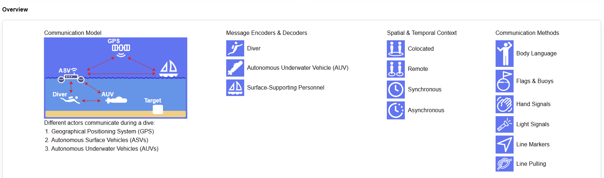
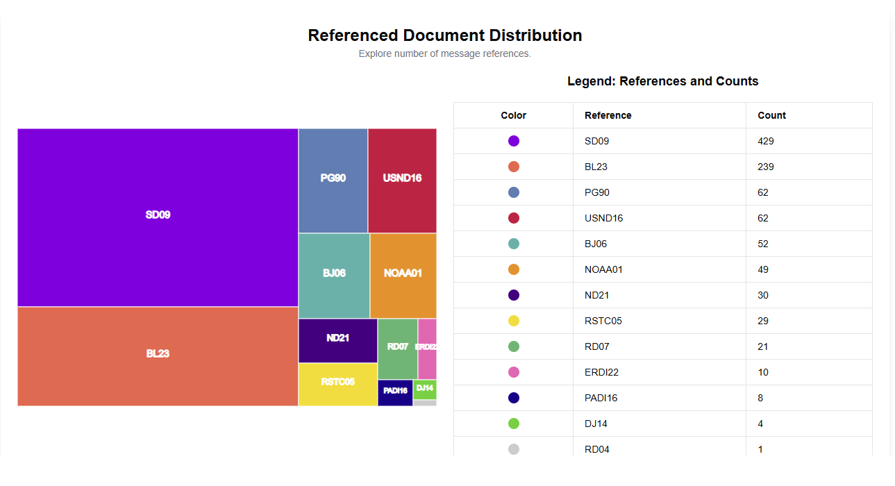
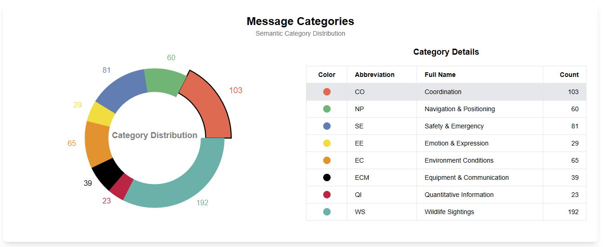
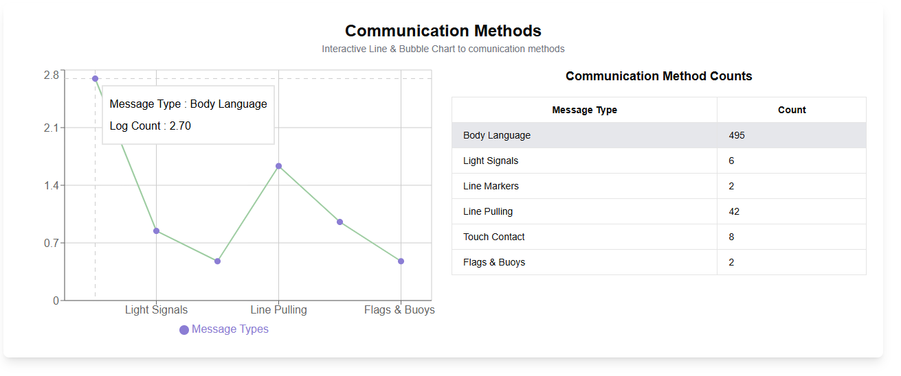
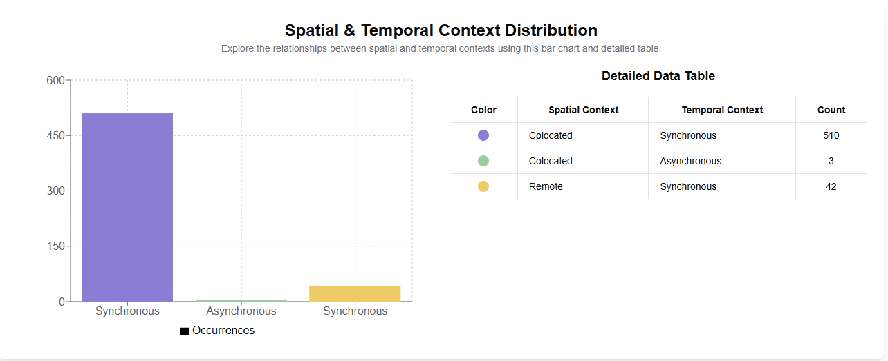
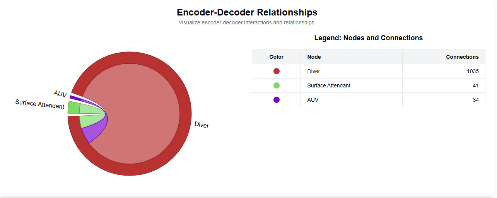
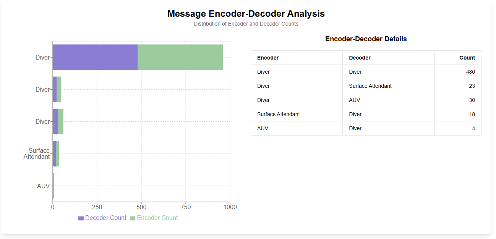

## Getting Started

### Prerequisites
Ensure you have the following installed on your machine:
- Node.js (version 14.x or later)
- npm (version 6.x or later)

### Downloading the Project
1. Clone the repository:
    ```sh
    git clone https://github.com/jomana-masalma/Data-visualization.git
    ```
2. Navigate to the project directory:
    ```sh
    cd your-repo-name
    ```

### Installing Dependencies
Install the required dependencies using npm:
```sh
npm install
  ```


### Running the App
Start the development server:
```sh
npm run dev
  ```
Open your browser and navigate to http://localhost:3000 to see the app in action.


  ### Building for Production
To build the project for production, run:

```sh
npm run build
  ```

  ### Runing the Production Server
To start the applicaiton, run:

```sh
npm run start
  ```

### Communication model
to familiarize yourself with data check the communicaiton model.



## Data Sample

```json
{
    "id": "5eae75b5-cfcd-4075-9915-4f3e7bf4ab2c",
    "premise": "",
    "message": "OK",
    "messageVariations": [],
    "description": "Making the signal simply involves nodding the head.",
    "meaning": "The hand signal for 'I am OK' is often accompanied by a slight nod of the head to emphasize the meaning.",
    "messageEncoder": "Diver",
    "messageDecoder": "Surface Attendant",
    "spatialContext": "Colocated",
    "temporalContext": "Synchronous",
    "type": "Body Language",
    "categories": [
        "CO"
    ],
    "references": [
        "BL23",
        "RD07",
        "RSTC05",
        "USND16",
        "BJ06",
        "SD09"
    ]
}
  ```


## TreeMap to address Reference



## PieChart to address Categories


## LineBubleChart to address message types


## BarChart to address Context: Spatial and Temporal


## ChordChart to address Encode-Decoder Relationships


## StackedBar to address Encode-Decoder Analysis in the model

